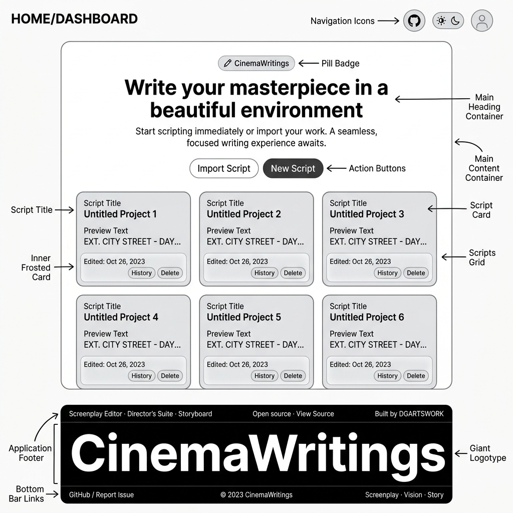
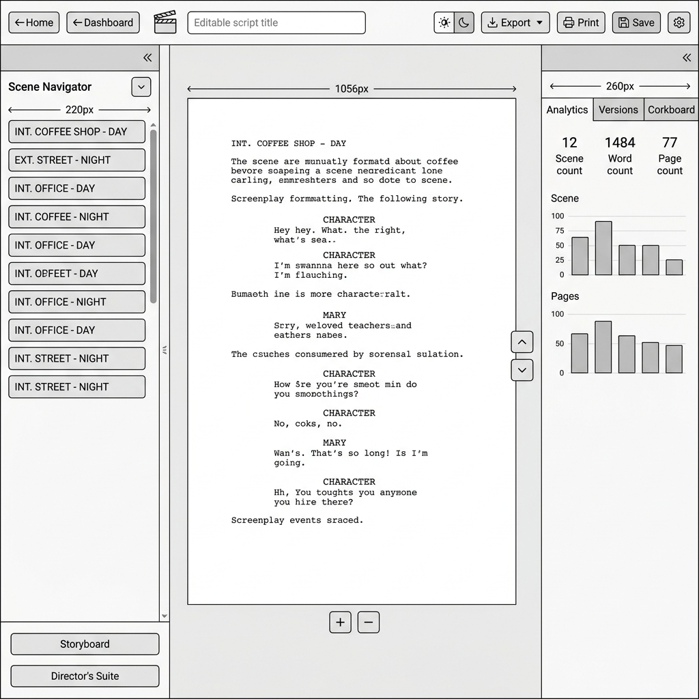
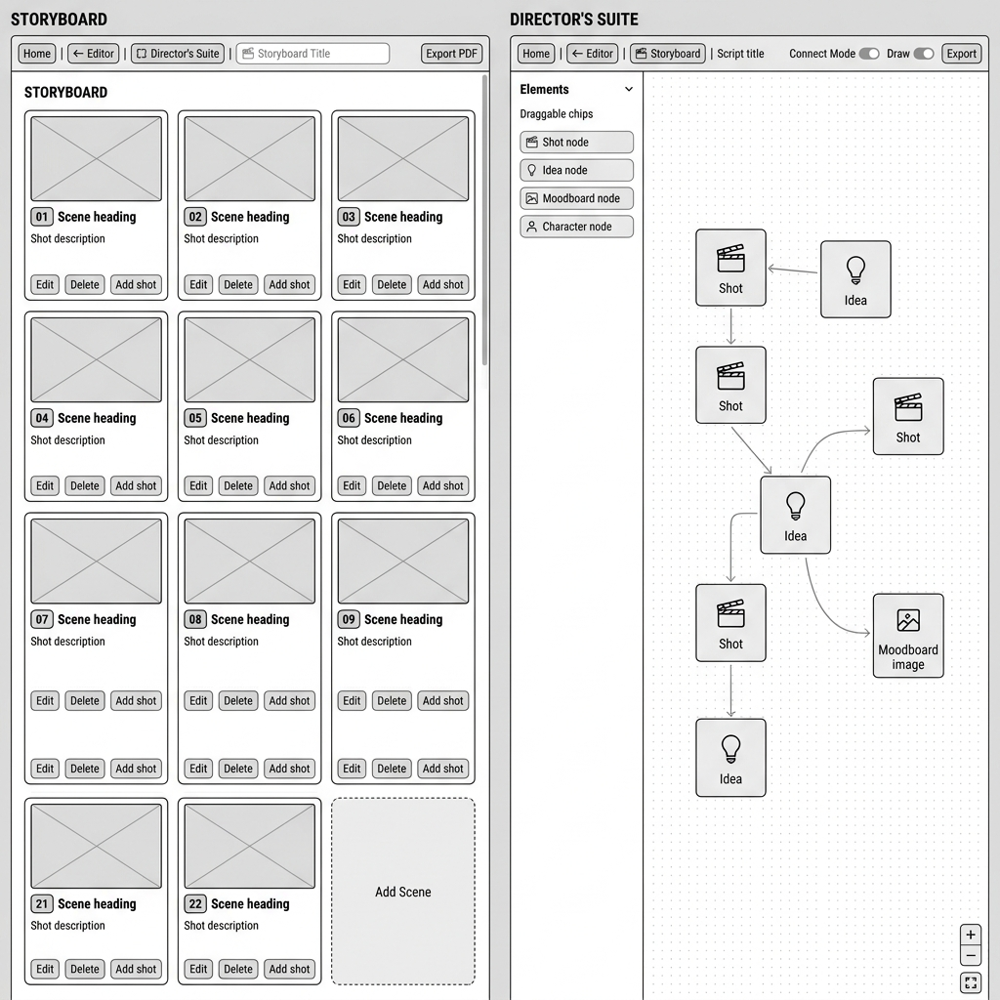

# CinemaWritings

**CinemaWritings** is a professional, browser-based screenplay editor built for writers who want industry-standard formatting without the complexity of traditional screenwriting software. Write, format, export, and collaborate — all in one beautiful, cinematic app.

**Live:** [https://cinemawritings.netlify.app](https://cinemawritings.netlify.app)

---

## Wireframes

### Home / Dashboard


---

### Screenplay Editor


---

### Storyboard + Director's Suite


---


## Features

### Editor
- **Universal Screenplay Import Engine** — Import PDF, FDX, Celtx, DOCX, and Fountain files instantaneously entirely on the client-side.
  - **Semantic Spatial Mapping**: Uses X-axis coordinate heuristics for PDF parsing, perfectly replicating original formatting.
  - **Smart Height Estimation**: Bypasses UI layout thrashing with pre-calculated, mathematically perfect pagination limits, guaranteeing zero-latency load times for massive documents.
- **TipTap-powered rich editor** with native bold, italic, and underline support
- **Screenplay element types** via keyboard shortcuts or the floating toolbar:
  - Scene Heading (`Ctrl+1`)
  - Action (`Ctrl+2`)
  - Character (`Ctrl+3`)
  - Dialogue (`Ctrl+4`)
  - Parenthetical (`Ctrl+5`)
  - Transition (`Ctrl+6`)
  - Shot (`Ctrl+7`)
- **Smart autocomplete** for character names, scene prefixes (`INT.` / `EXT.`), and standard transitions
- **`Ctrl+Space`** — opens the element selector menu at the cursor
- **Focus Mode** — a cinematic, distraction-free writing environment with a film-grain overlay and an **animated flickering candle** that lights up in the bottom-right corner when focus mode is active

### Title Page
- Editable title, author ("Written by"), "written by" prefix, and contact block
- **Dynamic Copyright** — the copyright line at the bottom-right of the title page is auto-generated from the author name field. Change the author → copyright updates instantly. Click directly on the copyright to type a custom value.
- **Logline** and **Synopsis** fields (collapsible) — included in all exports
- **Personal Information** — phone, email, address, website, agency (collapsible)

### Version History & Draft Comparison
- **Save named drafts** at any point
- **Restore** any previous draft with zero page flash
- **Side-by-side split-screen comparison** of any two drafts with full screenplay formatting preserved

### Exports
| Format | Description |
|---|---|
| **Screenplay PDF** | **Server-side generation (WeasyPrint)** — Generates a high-resolution, WGA-standard PDF adhering to exact Hollywood margins (1.5\" left bind). Captures the exact WYSIWYG state of your editor. |
| **Fountain (.fountain)** | Standard Fountain plain-text format with title metadata header block |
| **Microsoft Word (.docx)** | Formatted export for Microsoft Word |

### Account & Security
- **Full Name on Signup** — provide your name when creating an account; it's stored securely in your Supabase profile and shown in the account menu.
- **Cinematic Profile Dropdown** — Access your scripts and account settings via a sleek, dark-mode avatar menu.
- **Live Script List** — Quickly jump into your 5 most recent scripts directly from the profile menu.
- **Secure Password Updates** — In-app modal for updating account credentials via Supabase Auth.

### UX & Interface
- **Figma-style Font Size Control** — A highly interactive scrubber input for precise font sizing:
  - **Drag to Scrub** — Click and drag horizontally to sweep through values.
  - **Scroll Wheel** — Adjust size with the mouse wheel while focused.
  - **Precision Modifiers** — `Shift` for 10pt jumps, `Alt` for 0.1pt decimal precision.
  - **Mixed Selection Handling** — Displays `-` when multiple font sizes are selected.
- **Cinematic Loading System** — Seamless transitions with animated clapperboards, progress bars, and cycling film-themed loading messages.

### Storyboard Suite
- **Infinite Canvas Workspace** — Milanote-style infinite planning area with smooth 60fps panning and cursor-anchored zoom.
- **High-Performance Interaction** — Zero-latency dragging and resizing optimized via `requestAnimationFrame` for 1:1 cursor tracking.
- **Auto-Grid System** — Smart placement engine that organizes new cards into a clean grid by default.
- **Cinematic Aspect Ratio Library** — 24+ industry-standard ratios including 2.39:1 (Anamorphic), IMAX 70mm, Univisium, and 9:16 Vertical.
- **Resizable & Scrollable Cards** — Manual card resizing with internal scrollable areas for extensive technical and lighting notes.
- **Visual Image Management** — Hover-based action menu for direct image uploads or external URL pasting with live preview.
- **Bulk Management** — Marquee-based multi-selection with bulk deletion and "Clear Board" capabilities.
- **Connect Mode** — Visual wiring system to map shot-to-shot transitions and narrative flow.

### Context-Aware AI Assistant
- **Always-on-Top Chatbot** — The "Lead Producer" assistant is pinned above all UI elements (z-index 99999) and is draggable to any position on screen.
- **Feature Knowledge Base** — Covers screenplay formatting, title page & copyright, camera movements, storyboard, Director's Suite, exports, and account features.
- **Contextual Responses** — The assistant knows what page you're on and offers direct navigation links.
- **Quick Reply Chips** — One-tap shortcuts for the most common topics (Screenplay format, Title page, Copyright, Storyboard, etc.)

### Multi-Document Dashboard
- Create, organize, and delete multiple scripts
- Securely stored in the cloud via Django backend
- Script history timeline per document
- Pastel gradient card system with dark mode
- **Notes shortcut on each script card** — jump directly to per-script notes from the dashboard

### Notes Editor
- **Per-Script Notes** — Each script has its own personal notepad accessible from the Editor, Director's Suite, Storyboard, and Dashboard
- **Global Notes** — A standalone `My Notes` page accessible from the home dashboard for notes not tied to any script
- **Django-backed persistence** — Notes are stored securely on the backend, private per user
- **Auto-save** — Changes are saved automatically with an 800ms debounce
- **Pin notes** — Pin important notes to keep them at the top of the sidebar
- **Color themes** — Choose from 6 cinematic note colors (Ink, Forest, Navy, Wine, Amber, Slate)
- **Search** — Full-text search across note titles and content
- **Navigation** — Seamless back-navigation to Editor / Director's Suite / Storyboard from within the Notes page


---

## Director's Suite (Pre-Production Canvas)

A full-featured, Milanote-style **infinite canvas workspace** for pre-production planning and shot design.

### Canvas & Navigation
- **Infinite Canvas** — A 10,000×10,000px workspace for boundless creativity
- **Smooth 60fps Panning** — High-performance, Direct DOM panning that bypasses React re-renders entirely for silky smooth navigation
- **Cursor-Anchored Zoom** — Scroll wheel zooms precisely toward your cursor position (5% increments per scroll tick)
- **Multi-Method Pan** — Middle mouse button, Spacebar+Drag, or Trackpad two-finger scroll
- **Zoom Presets** — Quick-access preset panel (25%, 50%, 75%, 100%, 150%)
- **Fit to Content** — One-click to frame all your cards in view
- **Viewport Persistence** — Your last zoom level and pan position are remembered on return

### Node Cards
- **Shot Card** — Full cinematography metadata: Shot Type, Camera Movement, Lens, Description, Notes, Reference Image upload, and Reference Link
- **Idea Card** — Freeform writing pad with 6 colour-coded background variants
- **Image Card** — Reference moodboard card with URL paste, drag-and-drop file upload, and caption
- **Link Card** — Web reference card with Open Graph auto-preview for titles and favicons

### Connections
- **Connect Mode** — Wire any two cards together with directional bezier connection lines
- **Drag Handles** — In Connect Mode, a dedicated grip handle appears on every card so you can freely reposition cards without toggling modes
- **Smart Bezier Curves** — Connection lines bend naturally in any direction (horizontal, vertical, diagonal)
- **One-Click Delete** — Click the X button at the wire midpoint to remove a connection

### Freehand Drawing
- **Draw Mode Toggle** — Activates a custom pen cursor across the entire workspace
- **5 Drawing Tools:**
  - **Pen** — Solid, precise strokes
  - **Pencil** — Semi-transparent, textured look
  - **Brush** — Wide, soft brush strokes
  - **Eraser** — True transparency eraser (destination-out)
  - **Select** — Drag-and-drop any individual drawn stroke to reposition it
- **Adjustable Color & Width** — Full color picker and width slider
- **Undo & Clear** — Step back one stroke or wipe the canvas clean
- **Coordinate-Aware** — Drawing coordinates are precisely translated across all zoom levels and pan positions, including negative canvas space
- **Persistent Strokes** — All strokes are stored as vector data in localStorage per script and survive page refreshes


---

## Tech Stack

| Layer | Technology |
|---|---|
| Framework | Next.js 16.2 (Turbopack) |
| Editor Core | TipTap / ProseMirror |
| Backend Core | Django REST Framework (Python) |
| DB / Storage | PostgreSQL (via Django ORM) + Supabase Auth |
| PDF Generation | WeasyPrint (Server-side) / jsPDF + dom-to-image-more (Client-side) |
| Styling | Tailwind CSS v4 + Custom CSS |
| Icons | Lucide React |
| Deployment | Netlify (Frontend) |

---

## Getting Started

### 1. Backend Setup (Django)
Navigate to the `backend` directory, install requirements, and run migrations:
```bash
cd backend
python -m venv venv
source venv/bin/activate
pip install -r requirements.txt
python manage.py migrate
python manage.py runserver
```

### 2. Frontend Setup (Next.js)
Open a new terminal in the root directory:
```bash
# Install dependencies
npm install

# Start the development server
npm run dev
```

---

## Project Structure

```
src/
├── app/
│   ├── page.tsx                        # Dashboard (Supabase-backed)
│   ├── login/                          # Supabase Auth Login
│   ├── signup/                         # Supabase Auth Signup
│   ├── editor/[id]/page.tsx            # Screenplay editor page
│   ├── directors-suite/[id]/page.tsx  # Director's Suite workspace
│   ├── storyboard/[id]/page.tsx       # Visual storyboard canvas
│   └── notes/
│       ├── page.tsx                    # Global notes (all scripts)
│       └── [id]/page.tsx               # Per-script notes editor
│
├── components/
│   ├── editor/
│   │   ├── ScriptEditor.tsx            # Main editor + theme sync
│   │   └── TitlePage.tsx               # Title page with metadata
│   ├── storyboard/
│   │   ├── StoryboardView.tsx          # Infinite storyboard canvas
│   │   ├── InlineSceneCard.tsx         # Resizable, cinematic shot card
│   │   └── ConnectorLayer.tsx          # Shot-to-shot connection wires
│   └── suite/
│       ├── Board.tsx                   # Infinite canvas engine
│       ├── ConnectorLayer.tsx          # SVG bezier connection wires
│       ├── DrawingCanvas.tsx           # Freehand drawing canvas overlay
│       ├── DrawingToolbar.tsx          # Floating drawing tools panel
│       ├── IdeaCard.tsx                # Idea node card
│       ├── ImageCard.tsx               # Moodboard image card
│       ├── LinkCard.tsx                # Web link reference card
│       ├── ShotCard.tsx                # Shot metadata card
│       └── SuiteToolbar.tsx            # Left sidebar toolbar
│
├── hooks/
│   ├── useDrawing.ts                   # Drawing engine with hit-detection & rAF throttling
│   ├── useDraggable.ts                 # Real-time cursor tracking & drag hook
│   ├── useStoryboardCanvas.ts          # Storyboard state & persistence
│   └── useSuiteState.ts               # Canvas state & persistence
│
├── lib/
│   └── api.ts                          # Django REST client (includes Notes CRUD)
│
└── styles/
    └── suite.css                       # Director's Suite design system
```

---

## Keyboard Shortcuts

| Shortcut | Action |
|---|---|
| `Ctrl+1` | Scene Heading |
| `Ctrl+2` | Action |
| `Ctrl+3` | Character |
| `Ctrl+4` | Dialogue |
| `Ctrl+5` | Parenthetical |
| `Ctrl+6` | Transition |
| `Ctrl+7` | Shot |
| `Ctrl+Space` | Open element selector menu |
| `Ctrl+B` | Bold |
| `Ctrl+I` | Italic |
| `Ctrl+U` | Underline |
| `Tab` | Accept autocomplete suggestion |
| `Escape` | Close autocomplete / exit focus mode |

### Director's Suite

| Shortcut | Action |
|---|---|
| `Space + Drag` | Pan canvas |
| `Scroll Wheel` | Zoom in/out (5% per tick) |
| `Ctrl+=` / `Ctrl+-` | Zoom in / Zoom out |
| `Ctrl+0` | Reset zoom to 100% |
| `Ctrl+Shift+H` | Fit all cards in view |

---

## License

MIT
